# Introduction

In this study, we focused on a sweetpotato population comprised of various cultivars and three bi-parental populations: Beauregard x Regal, its reciprocal cross, and Beauregard x Uplifter. A total of 376 individuals from these groups were genotyped utilizing the DArTag platform.

Our primary objective was to evaluate the efficiency and accuracy of the DArTag genotyping technology. This evaluation was approached with a dual-strategy:

 1. For the entire studied population, we computed the genomic relationship matrix (G). Further, we conducted a Principal Component Analysis (PCA) to study the distribution of these individuals. Based on our analysis, we anticipate that closely related individuals, such as full-sibs, will cluster together in the PCA plot. Conversely, unrelated individuals should appear more dispersed.

 2. Within the bi-parental populations, we aimed to test markers for their adherence to Mendelian segregation patterns and to calculate the recombination fractions.

As a concluding step, a genetic map will be constructed, using offspring from the Beauregard x Regal and its reciprocal cross. 

# Loading necessary packages


```r
require(mappoly)
require(AGHmatrix)
require(factoextra)
library(plot3D)
require(tidyverse)
require(gplots)
require(CMplot)
```


# Auxiliary functions 

This function get *Ipomea trifida* genome position in the pre-constructed by [Mollinari et al. 2020](https://doi.org/10.1534/g3.119.400620)

```r
#### Get I. trifida genome from BT map ####
get_trifida<-function(x){
  x<-x[grepl("Tf", x)]
  w<-strsplit(x, "_")
  res<-sapply(w, function(z) {
    if(length(z) == 6)
      return(as.numeric(z[4]))
    else
      return(as.numeric(z[3]))
  }
  )
  names(res)<-x
  return(res)
}
```

The next functions will be used to build maps in multiple chromosomes using parallel processing


```r
phasing_and_hmm_rf<-function(X,
                             thres.twopt = 5,
                             thres.hmm = 3,
                             sub.map.size.diff.limit = 10,
                             phase.number.limit = 1000){
  fl<-paste0("output_map_ch_",
             thres.twopt, "_",
             thres.hmm, "_",
             sub.map.size.diff.limit, "_",
             X$ch, "_",
             phase.number.limit,
             ".txt")
  sink(fl)
  map<-est_rf_hmm_sequential(input.seq = X$seq,
                             start.set = 3,
                             thres.twopt = thres.twopt,
                             thres.hmm = thres.hmm,
                             twopt = X$tpt,
                             verbose = TRUE,
                             tol = 10e-2,
                             tol.final = 10e-2,
                             phase.number.limit = phase.number.limit,
                             sub.map.size.diff.limit = sub.map.size.diff.limit,
                             info.tail = TRUE, 
                             detailed.verbose = TRUE)
  sink()
  return(map)
}
error_model<-function(X, error = 0.1, tol = 10e-4){
  X$maps[[1]]$seq.rf <- rep(0.01, length(X$maps[[1]]$seq.rf))
  x<-est_full_hmm_with_global_error(input.map = X,
                                    error = error,
                                    tol = tol,
                                    verbose = FALSE)
  return(x)
}
```

# Loading DArTag dose data

```r
## Loading Dart allele dose file
dose.Dart <- read.csv("DSp22-7577_Allele_Dose_Report_updateID.csv",
                      skip = 7, row.names = 1)
dim(dose.Dart)
```

```
## [1] 3120  380
```

```r
#### Six first columns of the data set
dose.Dart[,1:6] %>% glimpse(width = 80)
```

```
## Rows: 3,120
## Columns: 6
## $ AvgCountRef <dbl> 188.282123, 250.572222, 101.626959, 40.175141, 59.000000, …
## $ AvgCountSnp <dbl> 70.132394, 85.083916, 112.619048, 13.480851, 408.613260, 2…
## $ Chrom       <chr> "Chr01", "Chr01", "Chr01", "Chr01", "Chr01", "Chr01", "Chr…
## $ ChromPos    <int> 84128, 239479, 346934, 531131, 696870, 821046, 940930, 113…
## $ X95.145     <int> 3, 3, 2, 6, 0, 0, 2, 5, 6, 6, 6, 6, 1, 6, 6, 0, 4, 2, 6, 3…
## $ RB1         <int> 4, 5, 2, 5, 0, 1, 5, 6, 0, 6, 6, 5, 3, 6, 6, 1, 4, 2, 6, 3…
```

```r
dat.temp <- t(dose.Dart[,-c(1:4)])
dim(dat.temp)
```

```
## [1]  376 3120
```

```r
#### Missing data = -9
dat.temp[is.na(dat.temp)] <- -9
#### Screening out markers with more than 20% of missing data
dat.temp <- dat.temp[,-which(apply(dat.temp, 2, function(x) sum(x==-9)) > .1*nrow(dat.temp))]
#### Computing G matrix
G.mat <- AGHmatrix::Gmatrix(dat.temp, method = "VanRaden", ploidy = 6)
```

```
## Initial data: 
## 	Number of Individuals: 376 
## 	Number of Markers: 3072 
## 
## Missing data check: 
## 	Total SNPs: 3072 
## 	 0 SNPs dropped due to missing data threshold of 0.5 
## 	Total of: 3072  SNPs 
## 
## MAF check: 
## 	No SNPs with MAF below 0 
## 
## Heterozigosity data check: 
## 	No SNPs with heterozygosity, missing threshold of =  0 
## 
## Summary check: 
## 	Initial:  3072 SNPs 
## 	Final:  3072  SNPs ( 0  SNPs removed) 
##  
## Completed! Time = 0.337  seconds
```

```r
#### Different color for population partitions
pop.part <- character(nrow(G.mat))
pop.part[str_detect(rownames(G.mat), "BR")] <- "F1.BR"
pop.part[str_detect(rownames(G.mat), "RB")] <- "F1.RB"
pop.part[str_detect(rownames(G.mat), "BEAUREGARD")] <- "Beau"
pop.part[str_detect(rownames(G.mat), "REGAL")] <- "Regal"
pop.part[str_detect(rownames(G.mat), "CASE")] <- "F1.BU"
pop.part[pop.part==""] <- "Pop"

#### Heat map of G matrix (RB are mostly clustered)
heatmap(G.mat)
```

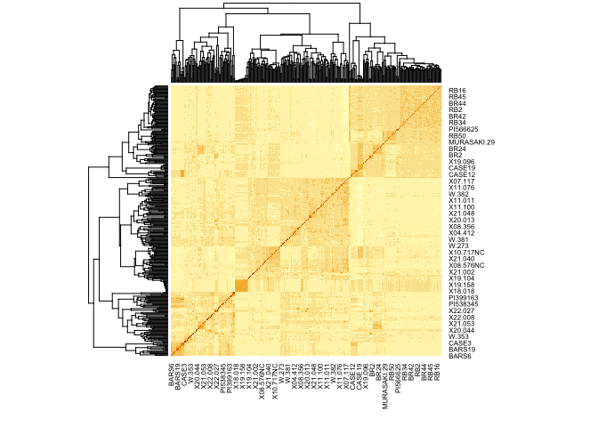<!-- -->

# SNP-density plot


```r
u <- dose.Dart[,3:4]
u <- rownames_to_column(u, "SNP")
colnames(u) <- c("SNP", "Chromosome", "Position")
head(u)
```

```
##               SNP Chromosome Position
## 1 Chr01_000084128      Chr01    84128
## 2 Chr01_000239479      Chr01   239479
## 3 Chr01_000346934      Chr01   346934
## 4 Chr01_000531131      Chr01   531131
## 5 Chr01_000696870      Chr01   696870
## 6 Chr01_000821046      Chr01   821046
```

```r
CMplot::CMplot(u,type = "p", plot.type = "d", bin.size = 1e6,
               file = "pdf", dpi = 300, main = "",
               file.output = FALSE, verbose = TRUE,
               width = 9, height = 6)
```

```
##  Marker density plotting.
```

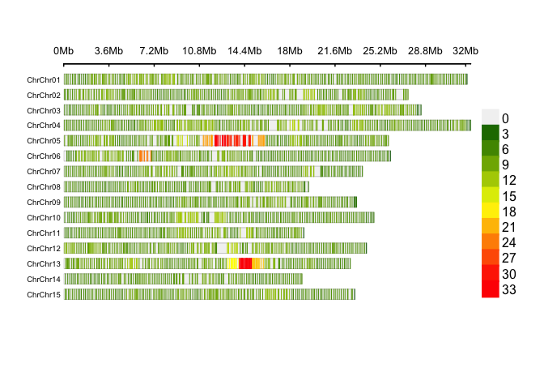<!-- -->

# Principal component analysis


```r
G.mat <- G.mat[sort(rownames(G.mat)), sort(colnames(G.mat))]
pop.part <- character(nrow(G.mat))
pop.part[str_detect(rownames(G.mat), "BR")] <- "F1 Beauregard x Regal"
pop.part[str_detect(rownames(G.mat), "RB")] <- "F1 Regal x Beauregard"
pop.part[str_detect(rownames(G.mat), "BEAUREGARD")] <- "Beauregard"
pop.part[str_detect(rownames(G.mat), "REGAL")] <- "Regal"
pop.part[str_detect(rownames(G.mat), "CASE")] <- "F1 Beauregard x Uplift"
pop.part[pop.part==""] <- "Diverse population"

colors_vector <- c(
  "Beauregard"       = "#4053d3",
  "F1 Beauregard x Regal"     = "#ddb310",
  "F1 Regal x Beauregard"        = "#b51d14",
  "Regal" = "#00beff",
  "F1 Beauregard x Uplift"      = "#00b25d",
  "Diverse population"       = "gray39"
)
A <- prcomp(G.mat)

#### Explained variances vs dimensions
fviz_eig(A)
```

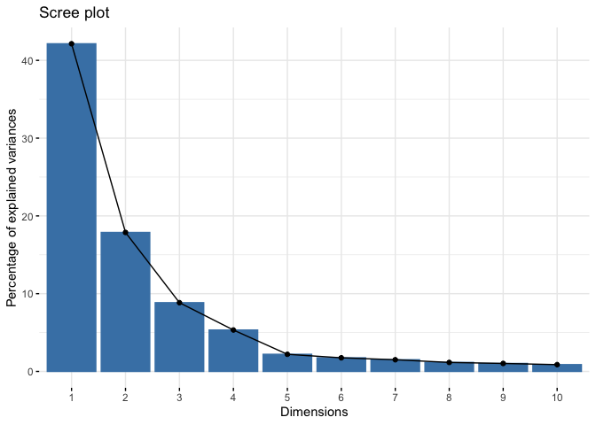<!-- -->

```r
PC1 <- A$x[,1]
PC2 <- A$x[,2]
PC3 <- A$x[,3]
par(mar = c(0,0.7,0,4), xpd = TRUE)
scatter3D(x = PC1,
          y = PC2,
          z = PC3,
          box=TRUE,
          pch=19, colkey = F,
          colvar = NULL,
          col = colors_vector[pop.part], 
          cex = 1,
          bty="g",
          ticktype="detailed",
          theta = -220, phi = 20,
          xlab = "PC1", ylab = "PC2", zlab = "PC3")
legend(x = .3, y = -.35, 
       legend = names(colors_vector), 
       col = colors_vector,
       pch = rep(19, length(colors_vector)), border = FALSE, bty = "n")
```

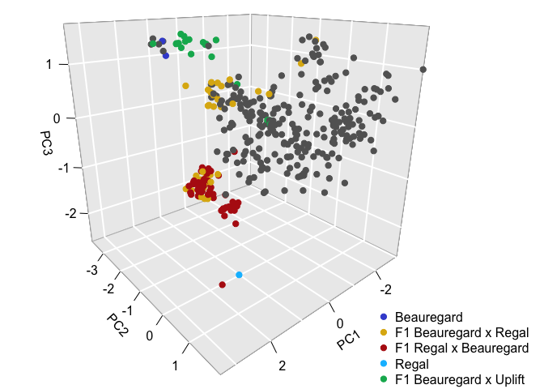<!-- -->

# Genetic mapping

## Parsing data


```r
#### Genetic mapping of F1 population
f1 <- dose.Dart[,colnames(dose.Dart)[str_detect(colnames(dose.Dart), "BR") | str_detect(colnames(dose.Dart), "RB")]]
p1<- dose.Dart[,colnames(dose.Dart)[str_detect(colnames(dose.Dart), "BEAUREGARD")]]
p2<- dose.Dart[,colnames(dose.Dart)[str_detect(colnames(dose.Dart), "REGAL")]]
#### Using markers where the two replicates of Beauregard had the same dosage calling
mrk.id <- which(apply(p1, 1, function(x) length(unique(x))==1))
#### Gathering genome positiomn
genome.pos <- as.numeric(sapply(strsplit(names(mrk.id), split = "Chr|_"), function(x) x[3]))
chrom <- as.numeric(sapply(strsplit(names(mrk.id), split = "Chr|_"), function(x) x[2]))
#### Data frame form MAPpoly
DF <- cbind(snp_id = names(mrk.id),
            P1 = p1[mrk.id,1],
            P2 = p2[mrk.id],
            chrom = chrom,
            genome_pos = genome.pos,
            f1[mrk.id,])
dat.dart <- mappoly::table_to_mappoly(DF, ploidy = 6)
plot(dat.dart)
```

## Filtering


```r
#### Filtering ####
dat.filt <- filter_missing(dat.dart, type = 'marker', filter.thres = 0.1, inter = FALSE)
dat.filt <- filter_missing(dat.filt, type = 'individual', filter.thres = 0.1, inter = FALSE)
#### Filtering individuals that are not from B x R cross
rm.ind <- c("RB3", "RB6", "RB11", "RB15", "RB22", "RB30", "RB41",
            "RB44", "RB46", "RB50", "RB52", "RB54", "RB56",
            "RB58", "BR2", "BR3", "BR5", "BR7", "BR8", "BR9",
            "BR10", "BR13", "BR20", "BR21", "BR24", "BR26",
            "BR27", "BR28", "BR30", "BR31", "BR40", "BR41")
dat.filt <- filter_individuals(input.data = dat.filt, ind.to.remove = rm.ind, inter = FALSE)
#### Filtering out distorted markers
s.f <- filter_segregation(dat.filt, chisq.pval.thres = 0.05/dat.filt$n.mrk, inter = F)
s <- make_seq_mappoly(s.f)
```

```r
s
```

```
## This is an object of class 'mappoly.sequence'
##     ------------------------
##     Parameters not estimated
##     ------------------------
##     Ploidy level:       6 
##     No. individuals:    60 
##     No. markers:        1285 
## 
##     ----------
##     No. markers per sequence:
##      chrom No.mrk
##          1    106
##         10     71
##         11     58
##         12     85
##         13     90
##         14     60
##         15     63
##          2     83
##          3     91
##          4    131
##          5    130
##          6     78
##          7     85
##          8     66
##          9     88
## 
##     ----------
##     No. of markers per dosage in both parents:
##    dP1 dP2 freq
##      0   1   30
##      0   2   21
##      0   3   11
##      0   4    2
##      1   0   18
##      1   1   36
##      1   2   32
##      1   3   41
##      1   4   16
##      1   5    2
##      1   6    1
##      2   0   12
##      2   1   32
##      2   2   59
##      2   3   44
##      2   4   36
##      2   5   17
##      2   6    2
##      3   0    6
##      3   1   26
##      3   2   54
##      3   3   71
##      3   4   61
##      3   5   37
##      3   6   10
##      4   0    4
##      4   1   21
##      4   2   44
##      4   3   69
##      4   4   98
##      4   5   70
##      4   6   12
##      5   1    3
##      5   2   19
##      5   3   31
##      5   4   76
##      5   5   71
##      5   6   19
##      6   3   10
##      6   4   27
##      6   5   34
```

```r
plot(s)
```

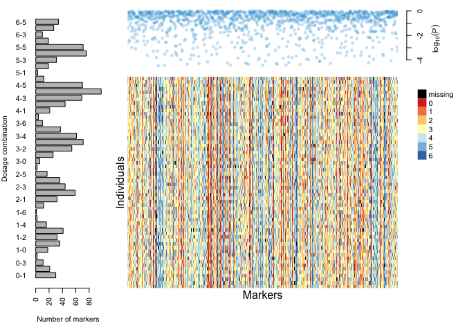<!-- -->


## Pairwise recombination fraction


```r
#### Two-points ####
tpt <- est_pairwise_rf(s, ncpus = 32)
m <- rf_list_to_matrix(tpt, thresh.LOD.ph = 1.0, thresh.LOD.rf = 1.0)
so <- make_seq_mappoly(get_genomic_order(s))
plot(m, ord = so, fact = 5)
```
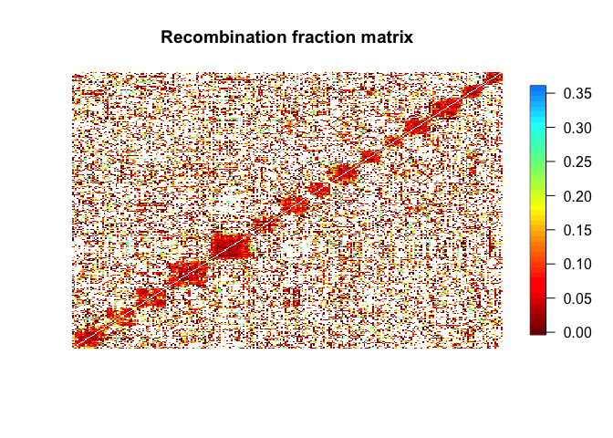<!-- -->

## Gathering information for each linkage group


```r
#### Assembling linkage groups (order based on genome) ####
LGS <- vector("list", 15)
#### loading BT map
load("~/repos/collaborations/sweetpotato_mid_density_genotyping_platform/Mollinari_et_al_2020_BT_map.rda")
names(maps) <- names(LGS) <- 1:15
#### preparing linkage groups for phasing
for(i in names(LGS)){
  s.temp <- make_seq_mappoly(dat.filt, s$seq.mrk.names[s$chrom == i])
  tpt.temp <- est_pairwise_rf(s.temp)
  m.temp <- rf_list_to_matrix(tpt.temp)
  bt.o <- get_trifida(names(maps[[i]]))
  A <- abs(kronecker(s.temp$genome.pos, t(bt.o), FUN = "-"))
  s.new <- make_seq_mappoly(dat.filt, s.temp$seq.mrk.names[order(apply(A, 1, which.min))])
  LGS[[i]] <- list(seq = s.new, tpt = tpt.temp, ch = i, mat = m.temp)
}
```
## Parallel map construction

```r
setwd("~/repos/collaborations/sweetpotato_mid_density_genotyping_platform/map_output/")
{
  cl <- parallel::makeCluster(15)
  parallel::clusterEvalQ(cl, require(mappoly))
  parallel::clusterExport(cl,  "dat.filt")
  initial.maps <- parallel::parLapply(cl, LGS, 
                                   phasing_and_hmm_rf, 
                                   thres.twopt = 5, 
                                   thres.hmm = 3, 
                                   sub.map.size.diff.limit = 10,
                                   phase.number.limit = 400)
  parallel::stopCluster(cl)
}
save(initial.maps, 
     dat.filt, 
     file = "~/repos/collaborations/sweetpotato_mid_density_genotyping_platform/result_5_3_10_400.rda")
setwd("~/repos/collaborations/sweetpotato_mid_density_genotyping_platform/map_output/")
{
  cl <- parallel::makeCluster(15)
  parallel::clusterEvalQ(cl, require(mappoly))
  parallel::clusterExport(cl,  "dat.filt")
  error.maps <- parallel::parLapply(cl, 
                                    initial.maps, 
                                    error_model, 
                                    error = 0.1, 
                                    tol = 10e-4)
  parallel::stopCluster(cl)
  plot_map_list(error.maps, col = viridis::turbo(20)[3:18])
}
```
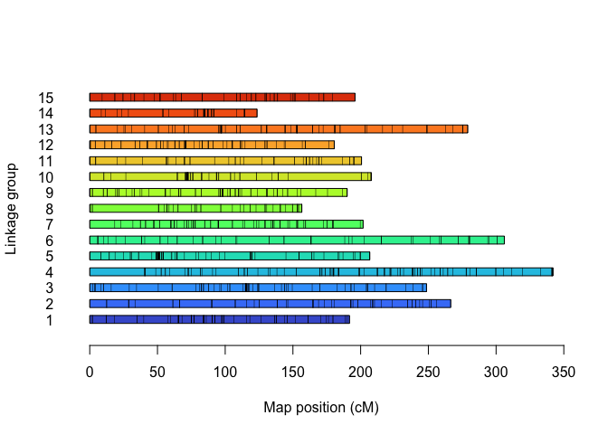<!-- -->

## Removing gaps
We addressed gaps in chromosomes 4 and 8 by eliminating one and three markers, respectively. While chromosome 10 exhibited a significant gap of 53.77 cM, we opted not to remove markers from its extremities. Doing so would have necessitated the removal of seven markers from the start and another five from the end, all of which were interlinked.


```r
final.maps <- error.maps
plot_map_list(final.maps, col = viridis::turbo(20)[3:18])
#### Chr 4 ####
print(final.maps[[4]], detailed = T)
final.maps[[4]] <- drop_marker(final.maps[[4]], 1)
#### Chr 8 ####
print(final.maps[[8]], detailed = T)
final.maps[[8]] <- drop_marker(final.maps[[8]], 1:3)
```


```r
genoprob <- vector("list", 15)
for(i in 1:15){
  genoprob[[i]] <- calc_genoprob_error(final.maps[[i]], step = 1, error = 0.1)   
}

homologprob <- calc_homologprob(genoprob)

save.image(file = "~/repos/collaborations/sweetpotato_mid_density_genotyping_platform/result_5_3_10_400.rda")
```


```r
summary_maps(final.maps)
```

```
## 
## Your dataset contains removed (redundant) markers. Once finished the maps, remember to add them back with the function 'update_map'.
```

```
##       LG Genomic sequence Map length (cM) Markers/cM Simplex Double-simplex
## 1      1                1          191.72        0.4       9              4
## 2      2                2          272.97       0.22       9              7
## 3      3                3          248.63       0.31       3              9
## 4      4                4          301.43       0.38      10              9
## 5      5                5          206.77       0.57      20             11
## 6      6                6          306.08       0.18       6              6
## 7      7                7          201.79        0.4       2             11
## 8      8                8          105.84       0.44       4              5
## 9      9                9          198.46       0.41       5              9
## 10    10               10          207.95       0.29       6              6
## 11    11               11          200.66       0.27       1              4
## 12    12               12           180.5       0.45       7              5
## 13    13               13          279.06       0.28       6              9
## 14    14               14          126.42       0.42       6              8
## 15    15               15          195.85       0.27       7              4
## 16 Total             <NA>         3224.13       0.35     101            107
##    Multiplex Total Max gap
## 1         63    76   17.98
## 2         45    61   27.92
## 3         66    78   17.52
## 4         95   114   17.49
## 5         87   118   22.83
## 6         44    56   24.84
## 7         68    81   19.92
## 8         38    47   14.71
## 9         68    82   16.96
## 10        48    60   53.77
## 11        49    54   18.16
## 12        69    81   17.21
## 13        63    78   22.38
## 14        39    53   25.64
## 15        42    53   16.57
## 16       884  1092   22.26
```

```r
plot_map_list(final.maps, col = viridis::turbo(20)[3:18])
```

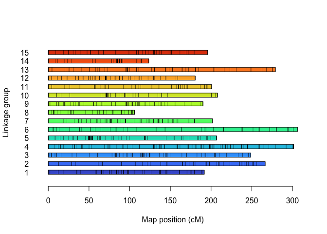<!-- -->

```r
plot_genome_vs_map(final.maps, same.ch.lg = TRUE, alpha = 1, size = 2)
```

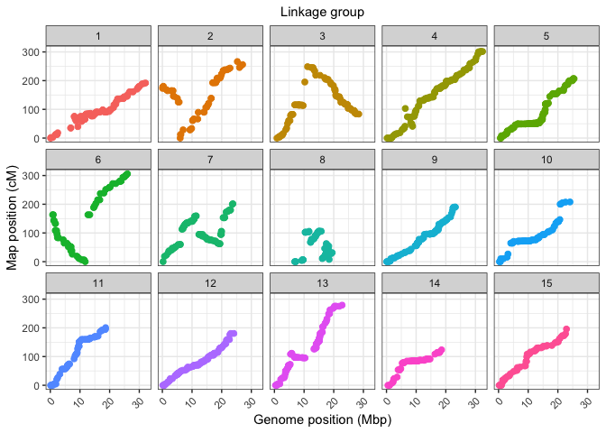<!-- -->

```r
plot(homologprob, use.plotly = FALSE)
```

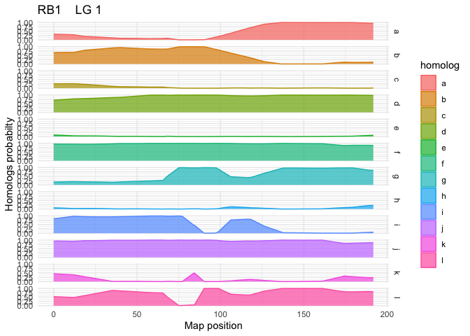<!-- -->

```r
for(i in 1:15){
  plot(final.maps[[i]], mrk.names = T, cex = .5, P = paste0("B_",i), Q = paste0("R_", i))  
}
```

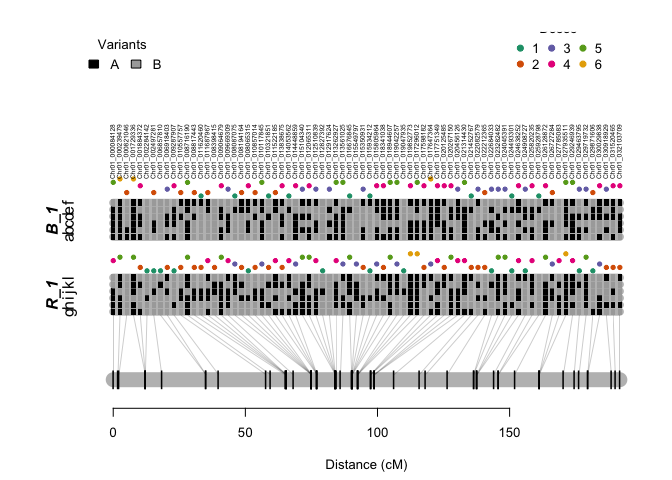<!-- -->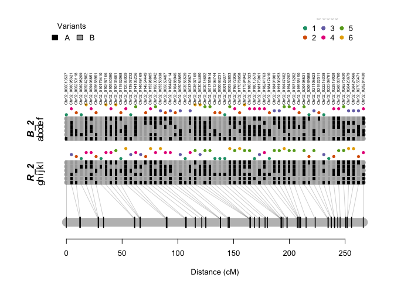<!-- -->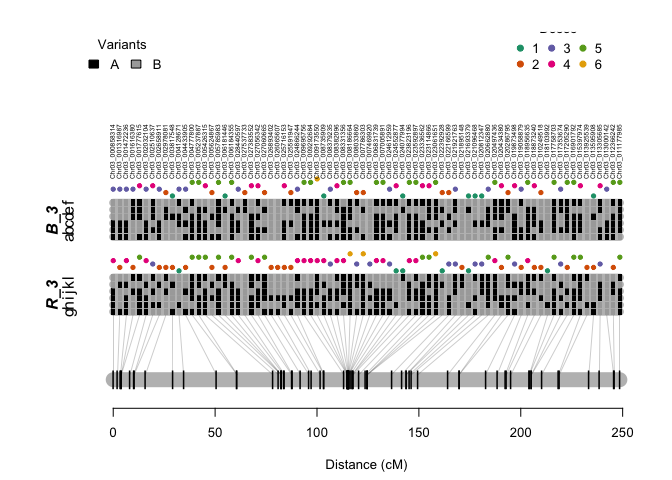<!-- -->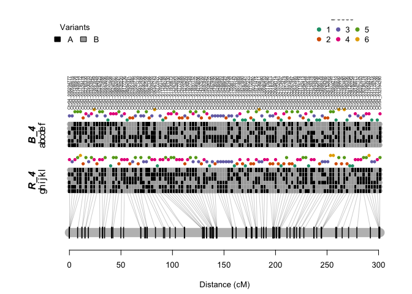<!-- -->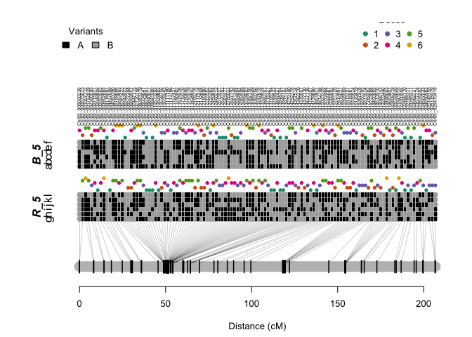<!-- -->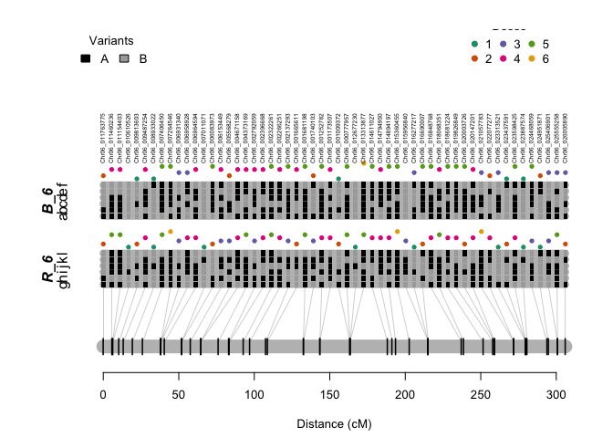<!-- --><!-- -->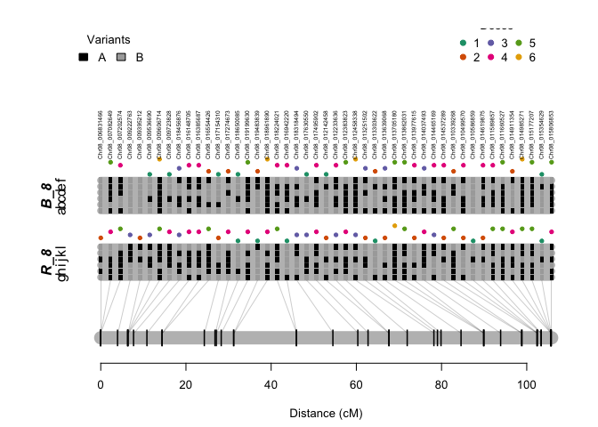<!-- -->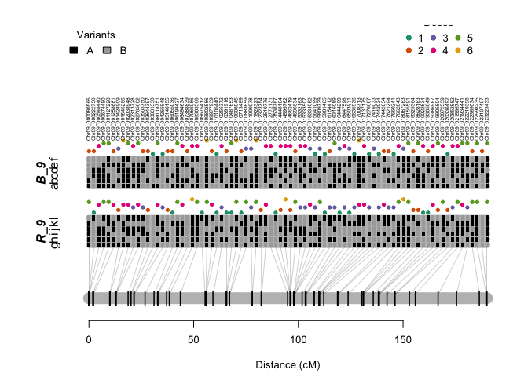<!-- -->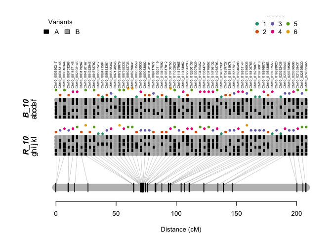<!-- -->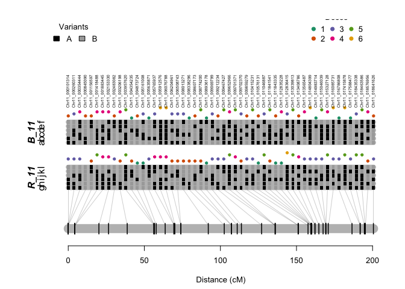<!-- -->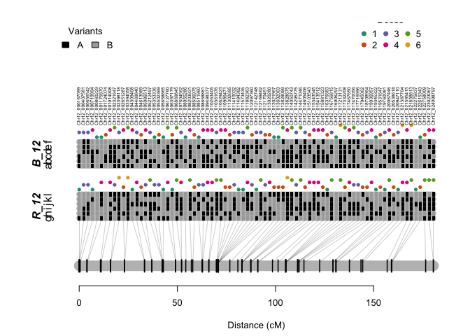<!-- -->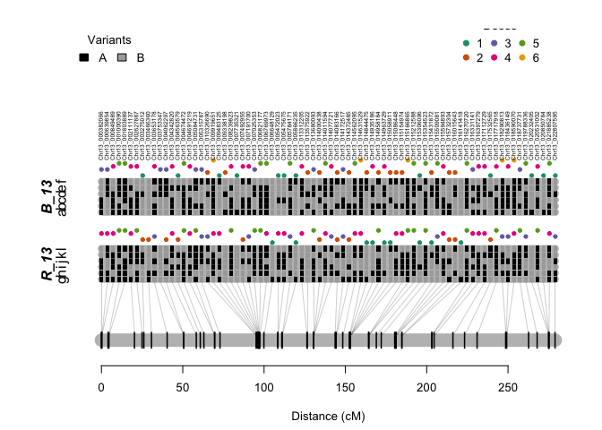<!-- -->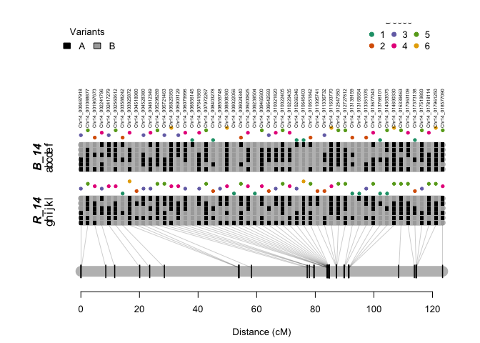<!-- -->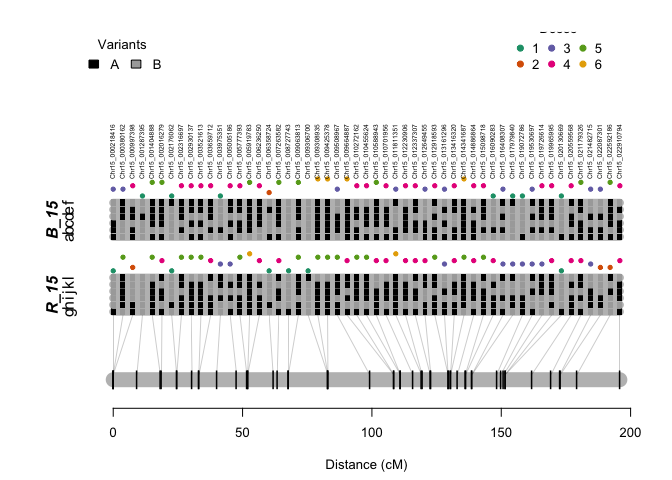<!-- -->
